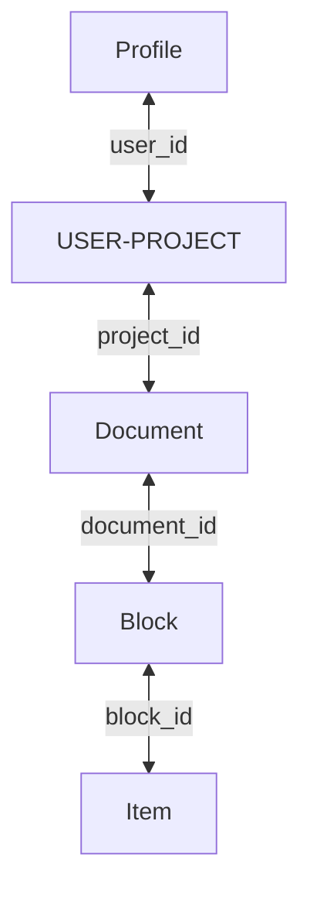

```mermaid
flowchart
USER-PROFILE[Profile] <--> |user_id| USER-PROJECT
USER-PROJECT <--> |project_id| DOCUMENT[Document]
DOCUMENT <--> |document_id| BLOCK[Block]
BLOCK[Block] <--> |block_id| ITEM[Item]
```
> item: id, index, blockId, description, type, value
> block: id, index, documentId, name
> document: id, projectId, name, documentType
> project: id, userId, name, description
