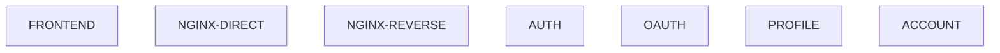
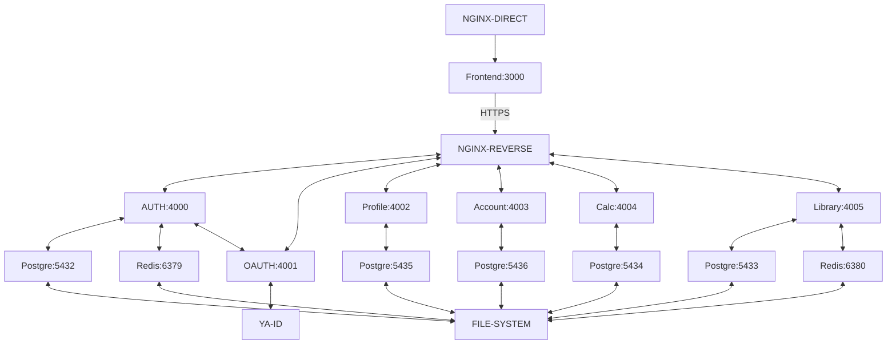

```mermaid
flowchart
FRONTEND
NGINX-DIRECT
NGINX-REVERSE
AUTH
OAUTH
PROFILE
ACCOUNT
```

```mermaid
flowchart
NGINX-DIRECT --> FRONTEND[Frontend:3000]
FRONTEND --> |HTTPS| NGINX-REVERSE
NGINX-REVERSE <--> AUTH[AUTH:4000]
NGINX-REVERSE <--> OAUTH[OAUTH:4001]
NGINX-REVERSE <--> PROFILE[Profile:4002]
NGINX-REVERSE <--> ACCOUNT[Account:4003]
NGINX-REVERSE <--> CALC[Calc:4004]
NGINX-REVERSE <--> LIBRARY[Library:4005]
LIBRARY <--> POSTGRE-LIBRARY[Postgre:5433]
LIBRARY <--> REDIS-LIBRARY[Redis:6380]
CALC <--> POSTGRE-CALC[Postgre:5434]
PROFILE <--> POSTGRE-PROFILE[Postgre:5435]
ACCOUNT <--> POSTGRE-ACCOUNT[Postgre:5436]


POSTGRE-CALC <--> FILE-SYSTEM
POSTGRE-PROFILE <--> FILE-SYSTEM
POSTGRE-ACCOUNT <--> FILE-SYSTEM

OAUTH <--> YA-ID
AUTH <--> POSTGRE[Postgre:5432]
AUTH <--> REDIS[Redis:6379]
AUTH <--> OAUTH
REDIS <--> FILE-SYSTEM
REDIS-LIBRARY <--> FILE-SYSTEM
POSTGRE <--> FILE-SYSTEM
POSTGRE-LIBRARY <--> FILE-SYSTEM
```