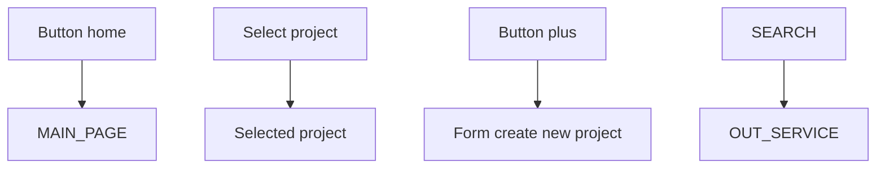
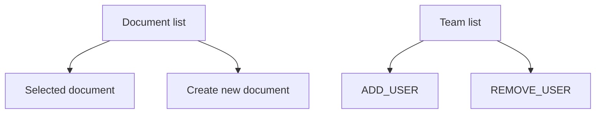
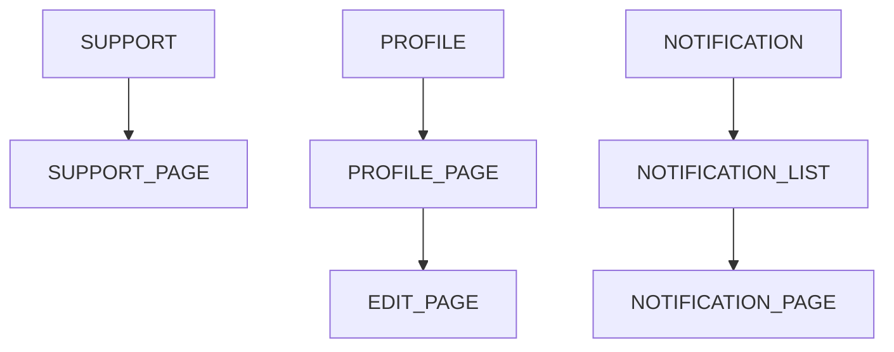

# SIDEBAR

## Sidebar-header

```mermaid
  flowchart
  
  HOME[Button home] --> MAIN_PAGE

  SELECT_PROJECT[Select project] --> SELECTED_PROJECT[Selected project]

  PLUS_PROJECT[Button plus] --> FORM_ADD_PROJECT[Form create new project]

  SEARCH --> OUT_SERVICE
```

## Sidebar-main

```mermaid
  flowchart
  
  DOCUMENTS[Document list] --> SELECTED_DOCUMENT[Selected document]
  DOCUMENTS --> ADD_DOCUMENT[Create new document]

  TEAMS[Team list] --> ADD_USER
  TEAMS --> REMOVE_USER
```

## Sidebar-footer

```mermaid
  flowchart

  SUPPORT --> SUPPORT_PAGE

  PROFILE --> PROFILE_PAGE
  PROFILE_PAGE --> EDIT_PAGE

  NOTIFICATION --> NOTIFICATION_LIST
  NOTIFICATION_LIST --> NOTIFICATION_PAGE
```
